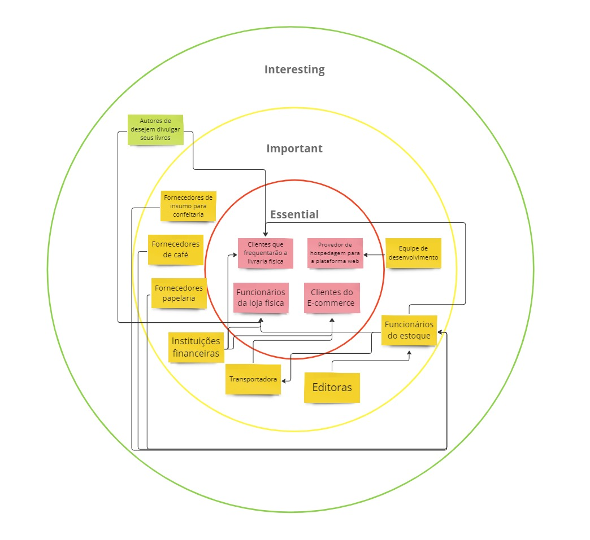
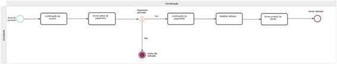
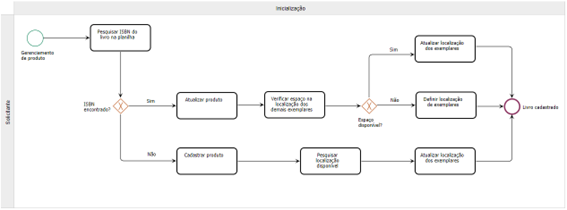
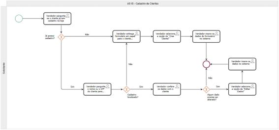
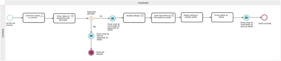
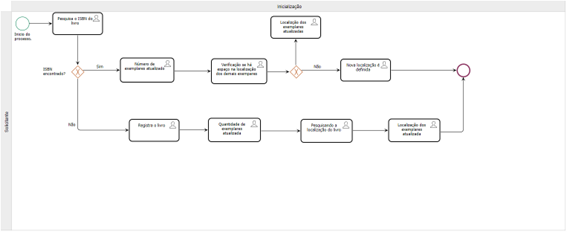
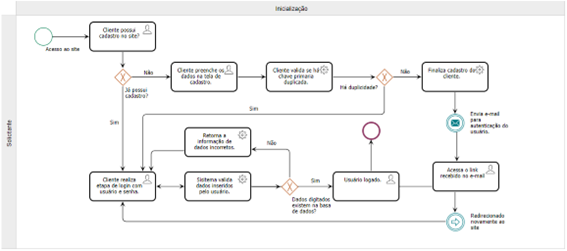

Café com Letras - "Cultura em cada xícara."

Allan dos Anjos Viana,

Danilo Leal Raul,

João de Sousa Lourenço,

Marco Tulio Crecencio Araujo,

Mariana Carvalho Silva Ribeiro,

Rodrigo Carvalho Cattoi da Costa

​### Instituto de Informática e Ciências Exatas– Pontifícia Universidade de Minas Gerais (PUC MINAS)

Belo Horizonte – MG – Brasil

allan.viana2003@gmail.com

danilo.lealraul@gmail.com

joaodslourenco@gmail.com

marcotuliounifor@gmail.com

mariana.sukva.teixeira@gmail.com

rodrigoccattoi@gmail.com

Resumo: O projeto da Livraria Café com Letras busca modernizar e expandir a presença online de uma livraria independente, enfrentando os desafios de um espaço físico limitado e a concorrência com grandes plataformas de e-commerce. Com base na análise do mercado editorial pós-pandemia, o projeto visa melhorar o gerenciamento de estoque, ampliar o alcance de mercado através de um e-commerce, e valorizar o espaço como um ponto cultural e social, atraindo diferentes perfis de clientes e fortalecendo a comunidade local.

1. Introdução

1.1 Contextualização

    O mercado editorial, embora tenha passado por períodos difíceis nos últimos anos, vem em uma crescente no período pós-pandemia. De acordo com o Sindicato Nacional dos Editores de Livros, o faturamento do setor ultrapassou 2,5 bilhões de 2021 a 2022, com um aumento de 8,33%. Destaca-se que, uma parte significativa desse crescimento pode ser atribuída às vendas realizadas por meio de lojas online. Durante a pandemia, as vendas online se tornaram uma alternativa fundamental para o setor, e muitas livrarias passaram a focar seus esforços no e-commerce para alcançar o público, compensando, assim, as perdas nas vendas físicas.

    Nesse contexto, a Livraria Café com Letras é uma livraria independente localizada no centro de uma cidade de médio porte. Fundada há mais de duas décadas, a livraria sempre foi um ponto de encontro para leitores apaixonados e um espaço cultural que promove eventos literários, clubes de leitura e lançamentos de livros de autores locais, estabelecendo-se como um verdadeiro espaço de comunidade. No entanto, nos últimos anos, a livraria tem enfrentado dificuldades significativas para competir com grandes redes e plataformas de e-commerce que dominam o mercado de livros.

        1.1.1 Pesquisa

        Foi realizada uma pesquisa pelos integrantes do grupo através de matérias jornalisticas que podem fornecer uma base sólida para discutir as dinâmicas recentes do mercado editorial e como elas impactam livrarias independentes como a Livraria Café com Letras.

        1 Crescimento do Mercado Editorial Brasileiro Pós-Pandemia:

            Um estudo do Sindicato Nacional dos Editores de Livros (SNEL), em parceria com a Nielsen Bookscan, revelou que o mercado editorial brasileiro cresceu 8,3% em 2022 em comparação ao ano anterior, com um total de 58,6 milhões de exemplares vendidos. Esse crescimento foi impulsionado, em grande parte, pelas vendas online, que se tornaram um canal crucial para o setor durante e após a pandemia. O relatório destaca que as livrarias exclusivamente virtuais representavam 24,8% do faturamento das editoras em 2020, um salto significativo em relação a 2018​(
            Metrópoles | O seu portal de notícias, PublishNews).

        2 Mudança no Perfil das Livrarias Físicas:

            Após a pandemia, houve um ressurgimento das livrarias de rua e de nicho, que estão se estabelecendo como espaços de experiência cultural e interação social. O término da era das megalivrarias abriu espaço para que pequenas livrarias com curadoria especializada e atendimento personalizado ganhassem relevância. Essas livrarias, ao oferecerem eventos culturais e um ambiente convidativo, conseguem criar uma conexão emocional com os clientes, algo que é difícil de replicar nas plataformas de e-commerce​(Correio Braziliense, Metrópoles | O seu portal de notícias).

        3 Impacto da Pandemia nas Vendas de Livros:

            A pandemia acelerou a transformação digital no mercado editorial, forçando editoras e livrarias a se adaptarem rapidamente ao comércio eletrônico. Segundo o PublishNews, o crescimento das vendas online já estava em andamento antes da pandemia, mas foi amplificado pela crise das grandes redes de livrarias. Em subsetores como obras gerais, as livrarias exclusivamente virtuais passaram a responder por até 50% do faturamento​(PublishNews).

        4 Desafios Econômicos e Recuperação do Setor:

            Apesar do crescimento, o mercado editorial enfrenta desafios, como o alto índice de endividamento das famílias brasileiras e a recuperação lenta da economia. Esses fatores afetam o poder de compra dos consumidores, o que impacta diretamente as vendas de livros. No entanto, subsetores como livros religiosos e didáticos têm mostrado resiliência e adaptação, utilizando novos canais de vendas para manter a relevância no mercado​(PublishNews).

1.2 Problema

    Em razão de contar com um espaço físico limitado, a Café com Letras sofre com a dificuldade de gerenciar seu estoque e permanecer atrativa ao seu público que, embora afeiçoado pela comunidade em torno da livraria, também é atraído pela variedade e comodidade oferecida pelas grandes lojas virtuais. A falta de uma presença online consolidada significa que a livraria depende quase exclusivamente dos clientes que visitam a loja fisicamente, o que limita suas vendas e alcance de mercado.

    Além disso, a concorrência acirrada com grandes players do mercado de livros, que oferecem uma vasta seleção de títulos e preços competitivos, tem pressionado ainda mais as margens de lucro da livraria. Por fim, a capacidade limitada de estoque em razão do tamanho da loja faz com que exista uma dificuldade em gerenciar os livros disponíveis e aqueles mais desejados pelos clientes.

1.3 Objetivo geral

    Elaborar uma solução integrada que permita à Livraria Café com Letras expandir sua presença online, melhorar o gerenciamento de estoque e aumentar a competitividade no mercado.

1.3.1 Objetivos específicos

● Permitir o cadastro de pessoas físicas, que possibilitará a compra de livros.

● Valorizar não somente o produto, mas principalmente o apelo educativo.

● Incenticar a população ao interesse cultural, em um ambiente de fácil acesso.

● Socialização entre usuários, através de um ambiente acolhedor.

1.3.2 Público-Alvo

● Criamos algumas personas, para exemplificar o público alvo dos nosso modelo de negócios.

Primera persona: Fulano da Silva
Idade: 45 anos 
Ocupação: Professor de História; leciona nos Ensinos Médio e Fundamental 2
Cliente da Loja Física: frequenta a livraria em busca de alternativas de livros didáticos e paradidáticos para aplicar em sala de aula

Segunda persona: Siclana Souza
Idade: 68 anos
Ocupação: Aposentada
Cliente da Loja Física: frequenta a livraria em busca de lançamentos e eventos literários. Também consome produtos no café utiliza o espaço para socialização

Terceira persona: Beltrano de Araújo
Idade 32 anos
Ocupação: Bancário
Potencial Cliente do e-commerce: tem o hábito de leitura e demonstra interesse pela livraria, pois passa em frente ao estabelecimento no seu deslocamento para o trabalho. Porém, prefere a comodidade das compras online e não conseguiu localizar o site da Café com Letras.

  1.4 Justificativas

      Esse projeto é importante porque a Café com Letras, como muitas livrarias pequenas, precisa se adaptar ao mercado digital para continuar competitiva. Com a criação de uma loja online e melhorias na gestão do estoque, a livraria terá a chance de atrair mais clientes e melhorar suas operações. Além disso, ajudar a livraria a se modernizar também contribui para manter vivo um espaço cultural valioso para a comunidade.

2.  Modelo de negócios

    O modelo de negócios do Café com Letras foi criado com base no Business Model Canvas, utilizando a plataforma canvanizer.com, com o objetivo de visualizar o que fazer, para quem e por que. O quadro está disponível no link: https://next.canvanizer.com/canvas/rb7oGc87wckvA

3.  Participantes do processo

    O Mapa de Stakeholder foi criado utilizando a plataforma Miro. Nele foram detectados os principais usuários que utilizaram e/ou foram afetados pela livraria café com letras. 

    
Imagem - Mapa de StakeHolders do Café com Letras.

4. Modelagem do processo de negócio

4.1 Análise da situação atual (AS-IS)
    
    Vendas - O processo de compra começa quando o cliente confirma a compra no carrinho. Em seguida, os dados de pagamento são enviados para aprovação. Se o pagamento for aprovado, o estoque é atualizado e o produto é enviado ao cliente, concluindo a venda. Se o pagamento não for aprovado, o cliente é informado sobre a falha e a venda não é realizada.

    Cadastro de Produtos - O cadastro de novos produtos é realizado em uma planilha de Excel. Quando novos livros chegam, a equipe do estoque pesquisa o código ISBN na planilha. Se o ISBN não for encontrado, são adicionadas as seguintes informações:

    - ISBN
    - Título
    - Autor
    - Editora

    Além disso, a quantidade de exemplares recebidos é registrada. Se o ISBN já estiver na planilha, apenas a quantidade de exemplares é atualizada. Em seguida, verifica-se a localização dos livros para garantir que há espaço disponível, e a localização é atualizada conforme necessário.

    Cadastro de Clientes - O vendedor pergunta ao cliente se ele já tem cadastro. Em caso positivo, o vendedor consulta os dados do cliente, pergunta se ele quer alterar alguma informação e finaliza o processo. Em caso negativo, o vendedor entrega um formulário em papel para preenchimento e aguarda; após receber o documento preenchido pelo cliente, o vendedor seleciona a tela de criação de cadastro e insere as informações nos respectivos campos.

Referências:
SINDICATO NACIONAL DOS EDITORES DE LIVROS. Painel do Varejo de Livros no Brasil. Disponível em: https://snel.org.br/wp/wp-content/uploads/2023/01/SNEL_13_2022_-_13T_2022.pdf. Acesso em: 23 ago. 2024.

4.2	Modelagem dos processos aprimorados (TO-BE)

    Vendas - O fluxo de vendas é iniciado quando o usuário faz o checkout no carrinho. Com os dados informados nos formulários, é feita uma requisição para o serviço de pagamentos a fim de verificar a validade do cartão e a disponibilidade de limite para realização do pedido. Caso haja um problema com o meio de pagamento informado, o usuário recebe um e-mail comunicando a falha no pagamento e o processo de venda é encerrado. Caso o pagamento seja processado com sucesso, o usuário recebe um e-mail confirmando o pagamento. O sistema então realiza uma atualização do estoque para dar baixa nos livros incluídos e gera um documento com informações sobre o pedido para auxiliar os colaboradores que irão proceder com o envio. Com o documento gerado, os colaboradores do centro de distribuição separam os livros no estoque e realizam a embalagem para então, por fim, fazer o envio do pedido. Uma vez enviado, o sistema envia um e-mail ao cliente comunicando o envio e a venda é concluída.

    Cadastro de Produtos - O processo de cadastro e atualização de livros em um sistema de gestão de estoque começa com a pesquisa do ISBN do livro. Ao inserir ou escanear o ISBN, o sistema verifica se o número já está registrado. Caso o ISBN seja encontrado, o sistema automaticamente atualiza o número de exemplares, somando os novos exemplares aos já existentes no estoque.
    Após essa atualização, o sistema realiza uma verificação automática para confirmar se há espaço disponível na localização atual dos exemplares. Se houver espaço, o sistema mantém os exemplares no mesmo local e atualiza a informação de localização. Porém, se não houver espaço suficiente, o sistema define uma nova localização adequada para os exemplares e registra essas informações automaticamente, sem a necessidade de intervenção manual.
    Caso o ISBN não seja encontrado no sistema, o livro ainda não foi cadastrado. Nesse caso, o sistema inicia o processo de registro do livro, coletando informações como o ISBN, título, autor e editora. Depois de preencher esses dados, o sistema registra a quantidade dos exemplares e, em seguida, busca uma localização disponível para armazená-los. Assim, o processo é concluído com a localização dos exemplares registrada e atualizada no sistema.
    Essa automação do processo torna a gestão de estoque de livros mais rápida e eficiente, reduzindo o tempo necessário para o cadastro e a atualização de exemplares e facilitando o trabalho da equipe responsável.

    Cadastro de Clientes - A etapa de cadastro de usuário no site é necessária para que o cliente possa realizar compras e para que haja um controle maior no momento de gerenciar o envio dos produtos vendidos. 
    O cliente acessa o site e caso já tenha cadastro no site realiza as etapas de login, podendo dar continuidade a sua navegação. Caso o usuário não possua cadastro, ele deverá preencher os dados na página de cadastro do site com e-mail, senha, dados de endereço, entre outros. Ao clicar em concluir, o sistema valida se não há duplicidade de dados no banco; caso haja o sistema informa que já existe usuário cadastrado e redireciona o mesmo para a página de login. Caso não haja duplicidade, o sistema conclui o cadastro e envia um e-mail para autenticação do cliente. O cliente recebe o e-mail e clica no link de confirmação, sendo redirecionado para o login.

