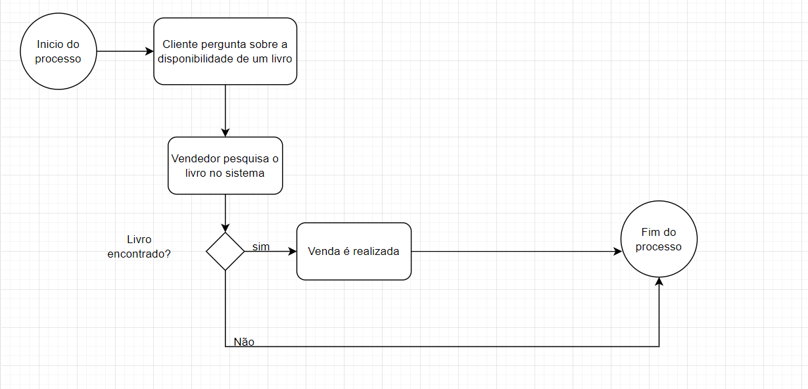
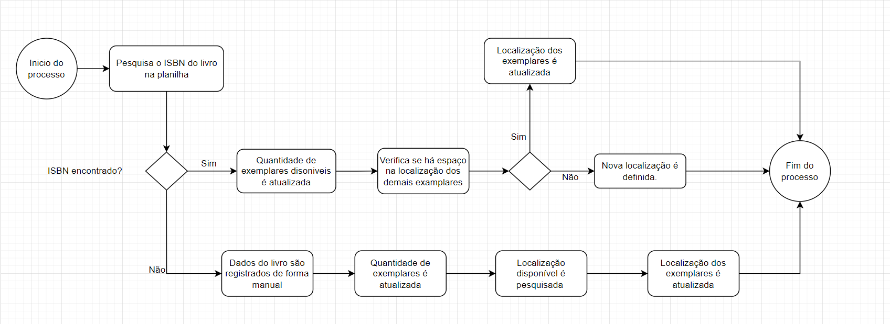
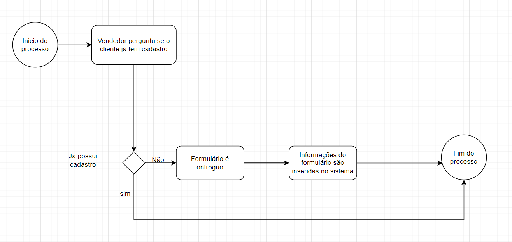

Café com Letras - "Cultura em cada xícara."

Allan dos Anjos Viana,

Danilo Leal Raul,

João de Sousa Lourenço,

Marco Tulio Crecencio Araujo,

Mariana Carvalho Silva Ribeiro,

Rodrigo Carvalho Cattoi da Costa

​### Instituto de Informática e Ciências Exatas– Pontifícia Universidade de Minas Gerais (PUC MINAS)

Belo Horizonte – MG – Brasil

allan.viana2003@gmail.com

danilo.lealraul@gmail.com

joaodslourenco@gmail.com

marcotuliounifor@gmail.com

mariana.sukva.teixeira@gmail.com

rodrigoccattoi@gmail.com

Resumo. .

1. Introdução

1.1 Contextualização

    O mercado editorial, embora tenha passado por períodos difíceis nos últimos anos, vem em uma crescente no período pós-pandemia. De acordo com o Sindicato Nacional dos Editores de Livros, o faturamento do setor ultrapassou 2,5 bilhões de 2021 a 2022, com um aumento de 8,33%. Destaca-se que, uma parte significativa desse crescimento pode ser atribuída às vendas realizadas por meio de lojas online. Durante a pandemia, as vendas online se tornaram uma alternativa fundamental para o setor, e muitas livrarias passaram a focar seus esforços no e-commerce para alcançar o público, compensando, assim, as perdas nas vendas físicas.

    Nesse contexto, a Livraria Café com Letras é uma livraria independente localizada no centro de uma cidade de médio porte. Fundada há mais de duas décadas, a livraria sempre foi um ponto de encontro para leitores apaixonados e um espaço cultural que promove eventos literários, clubes de leitura e lançamentos de livros de autores locais, estabelecendo-se como um verdadeiro espaço de comunidade. No entanto, nos últimos anos, a livraria tem enfrentado dificuldades significativas para competir com grandes redes e plataformas de e-commerce que dominam o mercado de livros.

        1.1.1 Pesquisa

        Foi realizada uma pesquisa pelos integrantes do grupo através de matérias jornalisticas que podem fornecer uma base sólida para discutir as dinâmicas recentes do mercado editorial e como elas impactam livrarias independentes como a Livraria Café com Letras.

        1 Crescimento do Mercado Editorial Brasileiro Pós-Pandemia:

            Um estudo do Sindicato Nacional dos Editores de Livros (SNEL), em parceria com a Nielsen Bookscan, revelou que o mercado editorial brasileiro cresceu 8,3% em 2022 em comparação ao ano anterior, com um total de 58,6 milhões de exemplares vendidos. Esse crescimento foi impulsionado, em grande parte, pelas vendas online, que se tornaram um canal crucial para o setor durante e após a pandemia. O relatório destaca que as livrarias exclusivamente virtuais representavam 24,8% do faturamento das editoras em 2020, um salto significativo em relação a 2018​(
            Metrópoles | O seu portal de notícias, PublishNews).

        2 Mudança no Perfil das Livrarias Físicas:

            Após a pandemia, houve um ressurgimento das livrarias de rua e de nicho, que estão se estabelecendo como espaços de experiência cultural e interação social. O término da era das megalivrarias abriu espaço para que pequenas livrarias com curadoria especializada e atendimento personalizado ganhassem relevância. Essas livrarias, ao oferecerem eventos culturais e um ambiente convidativo, conseguem criar uma conexão emocional com os clientes, algo que é difícil de replicar nas plataformas de e-commerce​(Correio Braziliense, Metrópoles | O seu portal de notícias).

        3 Impacto da Pandemia nas Vendas de Livros:

            A pandemia acelerou a transformação digital no mercado editorial, forçando editoras e livrarias a se adaptarem rapidamente ao comércio eletrônico. Segundo o PublishNews, o crescimento das vendas online já estava em andamento antes da pandemia, mas foi amplificado pela crise das grandes redes de livrarias. Em subsetores como obras gerais, as livrarias exclusivamente virtuais passaram a responder por até 50% do faturamento​(PublishNews).

        4 Desafios Econômicos e Recuperação do Setor:

            Apesar do crescimento, o mercado editorial enfrenta desafios, como o alto índice de endividamento das famílias brasileiras e a recuperação lenta da economia. Esses fatores afetam o poder de compra dos consumidores, o que impacta diretamente as vendas de livros. No entanto, subsetores como livros religiosos e didáticos têm mostrado resiliência e adaptação, utilizando novos canais de vendas para manter a relevância no mercado​(PublishNews).

1.2 Problema

    Em razão de contar com um espaço físico limitado, a Café com Letras sofre com a dificuldade de gerenciar seu estoque e permanecer atrativa ao seu público que, embora afeiçoado pela comunidade em torno da livraria, também é atraído pela variedade e comodidade oferecida pelas grandes lojas virtuais. A falta de uma presença online consolidada significa que a livraria depende quase exclusivamente dos clientes que visitam a loja fisicamente, o que limita suas vendas e alcance de mercado.

    Além disso, a concorrência acirrada com grandes players do mercado de livros, que oferecem uma vasta seleção de títulos e preços competitivos, tem pressionado ainda mais as margens de lucro da livraria. Por fim, a capacidade limitada de estoque em razão do tamanho da loja faz com que exista uma dificuldade em gerenciar os livros disponíveis e aqueles mais desejados pelos clientes.

1.3 Objetivo geral

    Elaborar uma solução integrada que permita à Livraria Café com Letras expandir sua presença online, melhorar o gerenciamento de estoque e aumentar a competitividade no mercado.

1.3.1 Objetivos específicos

● Permitir o cadastro de pessoas físicas, que possibilitará a compra de livros.

● Valorizar não somente o produto, mas principalmente o apelo educativo.

● Incenticar a população ao interesse cultural, em um ambiente de fácil acesso.

● Socialização entre usuários, através de um ambiente acolhedor.

1.3.2 Público-Alvo

● Criamos algumas personas, para exemplificar o público alvo dos nosso modelo de negócios.

Primera persona: Fulano da Silva
Idade: 45 anos 
Ocupação: Professor de História; leciona nos Ensinos Médio e Fundamental 2
Cliente da Loja Física: frequenta a livraria em busca de alternativas de livros didáticos e paradidáticos para aplicar em sala de aula

Segunda persona: Siclana Souza
Idade: 68 anos
Ocupação: Aposentada
Cliente da Loja Física: frequenta a livraria em busca de lançamentos e eventos literários. Também consome produtos no café utiliza o espaço para socialização

Terceira persona: Beltrano de Araújo
Idade 32 anos
Ocupação: Bancário
Potencial Cliente do e-commerce: tem o hábito de leitura e demonstra interesse pela livraria, pois passa em frente ao estabelecimento no seu deslocamento para o trabalho. Porém, prefere a comodidade das compras online e não conseguiu localizar o site da Café com Letras.

  1.4 Justificativas

      Esse projeto é importante porque a Café com Letras, como muitas livrarias pequenas, precisa se adaptar ao mercado digital para continuar competitiva. Com a criação de uma loja online e melhorias na gestão do estoque, a livraria terá a chance de atrair mais clientes e melhorar suas operações. Além disso, ajudar a livraria a se modernizar também contribui para manter vivo um espaço cultural valioso para a comunidade.

2.  Modelo de negócios

    O modelo de negócios do Café com Letras foi feito com base no Business Model Canvas, utilizando a plataforma canvanizer.com, com o objetivo de enxergar o que fazemos, para quem e por que. O quadro canvas está disponível no link: https://next.canvanizer.com/canvas/rb7oGc87wckvA

3.  Participantes do processo

    O Mapa de Stakeholder pode ser acessado de forma dinâmica pelo link: https://miro.com/app/board/o9J_knKlYCk=/ . Nele foram detectados os principais usuários que utilizaram e/ou foram afetados pela aplicação do Cit. Abaixo está anexada uma versão A4 estática do mapa de stakeholder circle.

Imagem4
Imagem 4 - Mapa de StakeHolders do Cit.

4. Modelagem do processo de negócio

4.1 Análise da situação atual (AS-IS)
    
    Vendas - Atualmente, a loja não oferece vendas online, então o cliente precisa ir até a loja para comprar um livro. O cliente solicita o livro ao vendedor, que verifica a disponibilidade. Se o livro estiver em estoque, a venda é realizada e concluída na hora.

    Cadastro de Produtos - O cadastro de novos produtos é realizado em uma planilha de Excel. Quando novos livros chegam, a equipe do estoque pesquisa o código ISBN na planilha. Se o ISBN não for encontrado, são adicionadas as seguintes informações:

    - ISBN
    - Título
    - Autor
    - Editora

    Além disso, a quantidade de exemplares recebidos é registrada. Se o ISBN já estiver na planilha, apenas a quantidade de exemplares é atualizada. Em seguida, verifica-se a localização dos livros para garantir que há espaço disponível, e a localização é atualizada conforme necessário.

    Cadastro de Clientes - O vendedor pergunta se o cliente já possui cadastro. Caso não tenha, o cliente recebe um formulário para preencher com as seguintes informações: nome completo, e-mail, telefone, CPF e endereço. Após o cliente concluir o preenchimento, o vendedor coleta o formulário e insere os dados no sistema.

Referências:
SINDICATO NACIONAL DOS EDITORES DE LIVROS. Painel do Varejo de Livros no Brasil. Disponível em: https://snel.org.br/wp/wp-content/uploads/2023/01/SNEL_13_2022_-_13T_2022.pdf. Acesso em: 23 ago. 2024.
